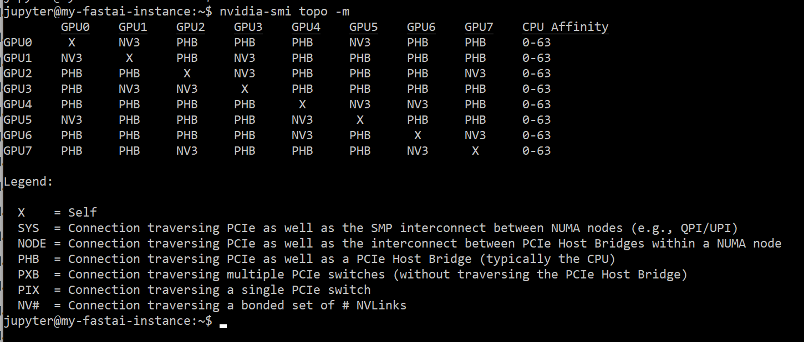
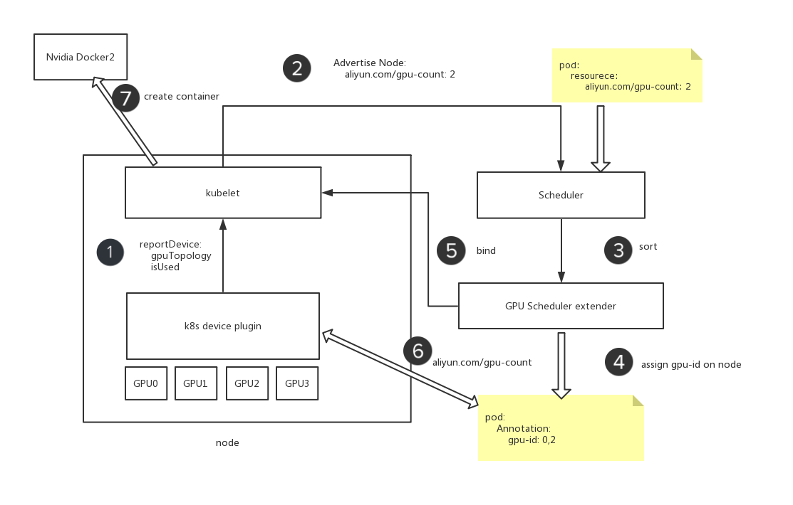

gsoc 设计文档更新版。

## 目标

当一个机器学习任务使用到 n 块 gpu 卡时，可根据 gpu 之间的拓扑，选择亲和性强的 gpu 完成任务。

## 非目标

节点内部的 亲和性除了 gpu 与 gpu 之间的亲和性外，还有 gpu 与 cpu 之间的亲和性。gpu 与 cpu 的亲和性不在此次考虑范围内。

## 约定

当只有一块gpu的时候，不考虑 gpu 拓扑结构。也就是说不存在 `map[0][0]` 这种情况

## 思路

### 1. device 上报 gpu topology

#### 1.1 nvml 获取 gpu topology 底层信息汇总

在 linux 机器中，可通过  `nvidia-smi topo -m` 获取机器的 gpu 拓扑信息。



缩写的对应关系如下

| P2PLinkType | P2PLinkTypeDesc | 缩写 | 带宽权值 |
| --- | --- | --- | --- |
| sdfP2PLinkCrossCPU | Cross CPU socket | SYS |  n |
| sdP2PLinkSameCPU | Same CPU socket | NODE | n |
| P2PLinkHostBridge | Host PCI bridge | PHB | n |
| P2PLinkMultiSwitch | Multiple PCI switches | PXB | n |
| P2PLinkSingleSwitch | Single PCI switch | PIX | n |
| P2PLinkSameBoard | Same board | PSB | n |
| SingleNVLINKLink |  | NV1 |  |
| TwoNVLINKLinks |  | NV2 | |
| ThreeNVLINKLinks |  | NV3 | |
| FourNVLINKLinks |  | NV4 | |


TODO: 这里带宽权重的设置需要找到依据。

参考文档：

[k8s-device-plugin nvidia包](https://github.com/NVIDIA/k8s-device-plugin/blob/master/vendor/github.com/NVIDIA/gpu-monitoring-tools/bindings/go/nvml/nvml.go#L101)

[gpu-monitoring-tools](https://github.com/NVIDIA/gpu-monitoring-tools/blob/master/bindings/go/dcgm/topology.go#L17)

[浅析GPU通信技术（中）-NVLink](https://yq.aliyun.com/articles/599183)

#### 1.2 通过 nvml 包获取 节点中 gpu topology 信息

device-plugin 在初始化的时候，通过 nvml 包获取 节点中 gpu 的信息，包括 gpu topoloy。 

设计 gpu topology 的数据结构如下：

```
type gpuTopologyType nvml.P2PLinkType

type gpuTopology map[uint]map[uint]gpuTopologyType

func (t gpuTopologyType)String() string  {
	return nvml.P2PLinkType(t).String()
}

// 例如：如下格式表示gpuTopology
map[0][0] = 0
```

#### 1.3 device-plugin 上报 gpu topology 给 node

使用 node annotation 字段表示 gpu tology

如： GPU_SYS_0_1: Cross CPU socket

> 这里的 SYS 来自于 Cross CPU socket 对应的缩写（详情参见上表）

#### 1.4 listAndWatch 上报自定义资源字段

device-plugin 在 listAndWatch 的过程 上传资源类型 "aliyun.com/gpu"

### 2. scheduler extender 根据 gpu topology 调度

#### 2.1 scheduler extender 的配置

```
{
  "kind": "Policy",
  "apiVersion": "v1",
  "extenders": [
    {
      "urlPrefix": "http://127.0.0.1:32743/gputopology-scheduler",
      "PrioritizeVerb" : "sort",
      "bindVerb":   "bind",
      "enableHttps": false,
      "nodeCacheCapable": true,
      "managedResources": [
        {
          "name": "aliyun.com/gpu",
          "ignoredByScheduler": false
        }
      ],
      "ignorable": false
    }
  ]
}
```

说明：

- scheduler extender 不需要 filter 过程，gpu topology 的 预选过程是通过，“节点中的gpu-count” 是否满足调节来预选。这个过程在默认调度器中完成。
- 新增 PrioritizeVerb 过程。此过程计算每个节点上的 满足gpu数量条件的 gpu 亲和性打分（即，计算每个节点上gpu 亲和性最好的方案对应的分数）。
- bind 过程。在符合条件，且最高分数（经过预选、优选过程）的 node 节点上，选择最优 gpu 组合方案，写入到 annotation上，完成绑定，更新pod的annotation 字段。

参考 [scheduler extender](https://github.com/kubernetes/community/blob/master/contributors/design-proposals/scheduling/scheduler_extender.md) 的设计

#### 2.2 scheduler extender 打分方案

优选过程可以拆分为一下两个步骤

- 选择最佳gpu组合设计
- 计算最佳组合的分数设计

[打分方案参照腾讯论文](./reference/gaia_gpu_topology/gaia_gpu_topology_scheduler.md)

todo: 设计自己的 gpu 调度方案

### 2.3 scheduler bind 方案

bind 的过程 将 最佳gpu组合方案，写入到 pod 的annotation 里。 同时记录分配时间ALIYUN_COM_GPU_ASSUME_TIME、是否实际分配到节点 ALIYUN_COM_GPU_ASSIGNED。

例如：
```
ALIYUN_COM_GPU_ASSIGNED: false
ALIYUN_COM_GPU_ASSUME_TIME: 1561717704
ALIYUN_COM_GPU_GROUP: 0,1,2,3
```

同时更新 pod 的annotion， 在 device 上记录运行的 pod 信息。

## 3. device plugin allocate 设计


allocate 获取分配的device 列表后，穿入环境变量 NVIDIA_VISIBLE_DEVICES 到nvidia-docker容器里，容器的任务会根据这个变量将任务运行在指定的GPU里。

同时也会更新 pod annotion 字段信息

```
ALIYUN_COM_GPU_ASSIGNED: true
ALIYUN_COM_GPU_ASSUME_TIME: 1561718702
```


## 流程

根据以上思路，可作下图简单描述整个流程



todo: 将自己做的工作用不同颜色标记出来，且贴上原来设计图的链接