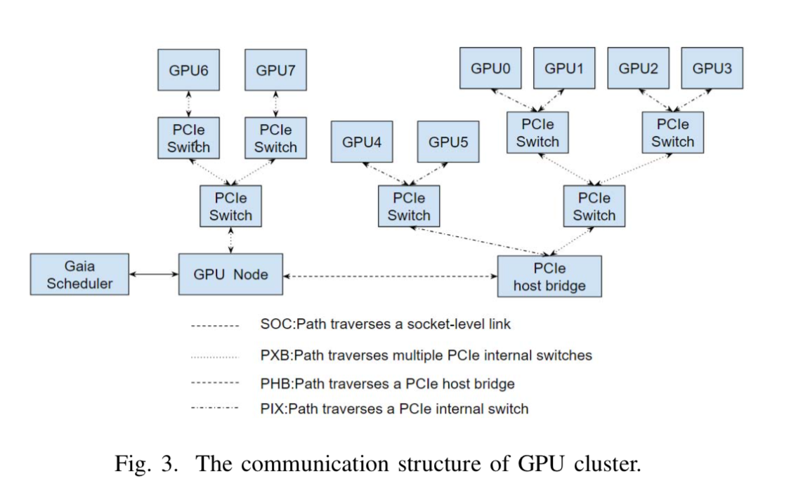
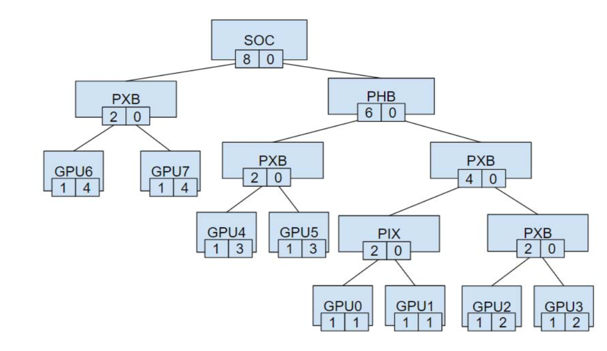
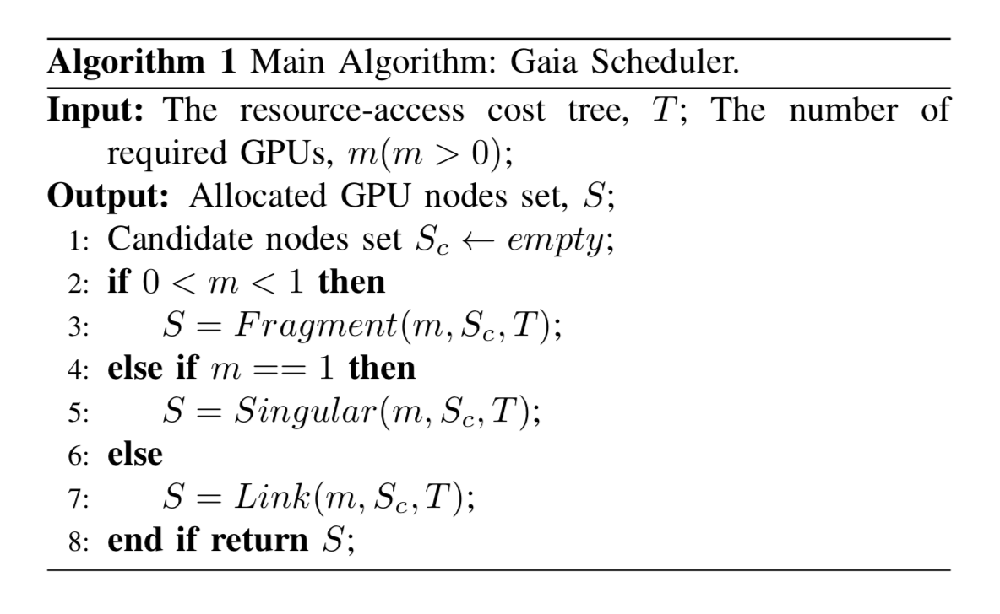
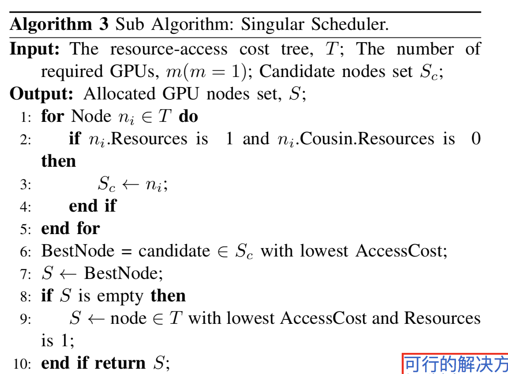
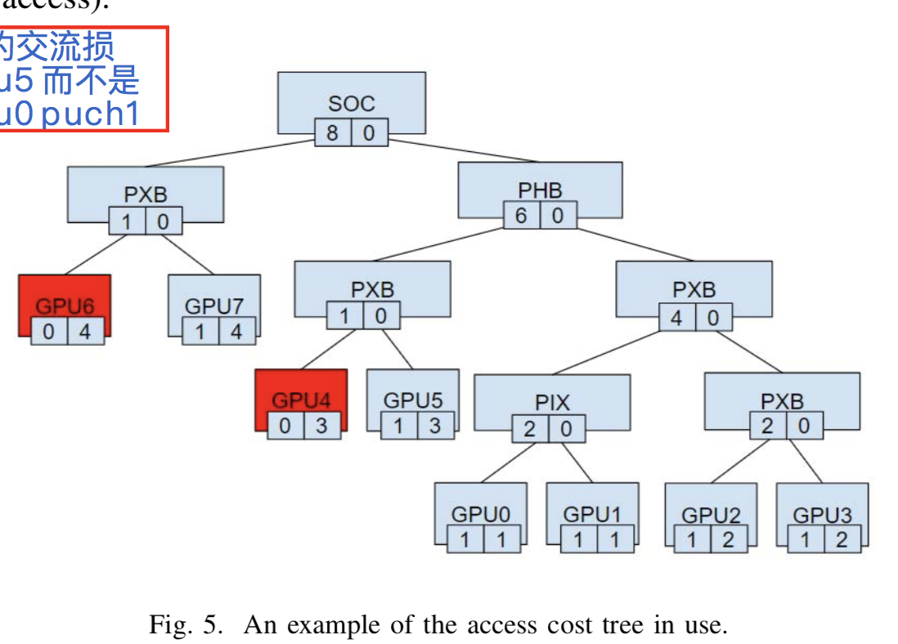
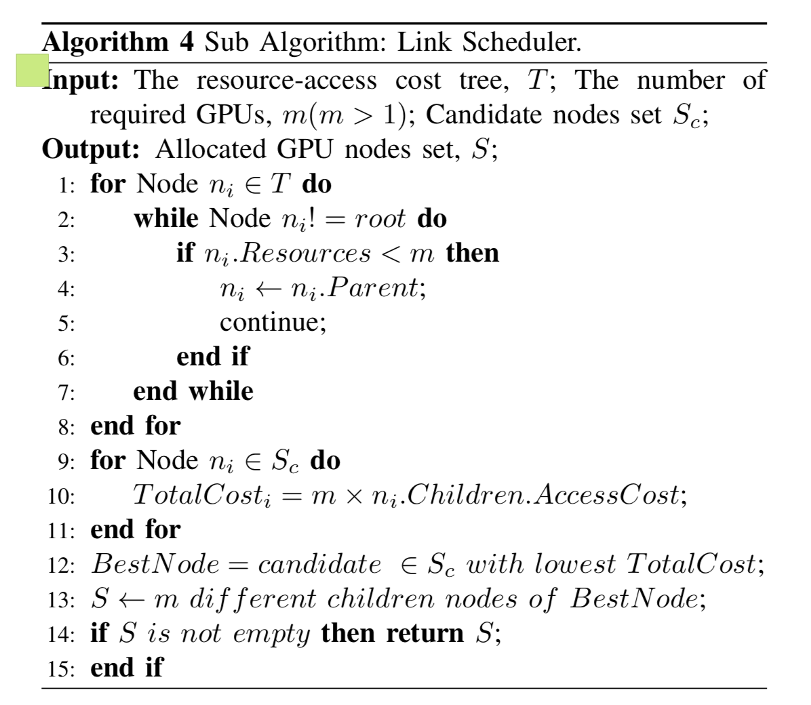

# Gaia: gpu topoloyg scheduler 方案解读

原论文在此文档同一目录。

### 准备工作

Nvidia 基于网络结构实现了 GUP 通信模式的分类

基于 Nvidia 的研究， Gaia 实现了 GPU集群 （单机器上的多卡gpu）资源访问消耗树算法，kubernetes 根据这个树进算法进行调度。

四种类型的通信代价：SOC > PHB > PXB > PIX

这个图可以体现 不同 GPU 之间的通信模式

节点左边的数值表示 GPU 可以访问的数量。0 表示该 GPU 已经使用了。1表示还可以再使用。

节点右边的数值表示 node 到该 gpu 的通信代价。 （即 cpu 亲和性？？）

### gpu 调度算法

gpu 调度算法入口

m 为请求的 gpu 数量， T 为 资源访问树，S 为返回结果， 可以访问的gpu

当0 < m < 1时候， S = Fragment(m, Sc, T)
当 m == 1 时， S = Singular(m, Sc, T)
当 m > 1 时， S = Link(m, Sc, T)

因为我们的项目补考虑 0 < m < 1 这种情况，所以这种情况跳过。

### 请求gpu数量为1时

当请求当数量为 1 的时候

遍历所有gpu，如果这个gpu可以访问，且它的相邻gpu已经使用过了，将它访入Sc中。
从 Sc 中选一个 cpu 亲和性最好的，作为最终调度结果。
如果 Sc 为空就从所有可访问gpu中选一个cpu 亲和性最好的。

例如：在如下例子中

如果按照传统调度方法就会调度到 0 或者 1 上。因为 0， 1 的消耗是最小的。但是如果实现此方法，就会调度到 5 上，因为要先考虑相邻 gpu 是否已经使用。

### 请求gpu > 1 时

todo